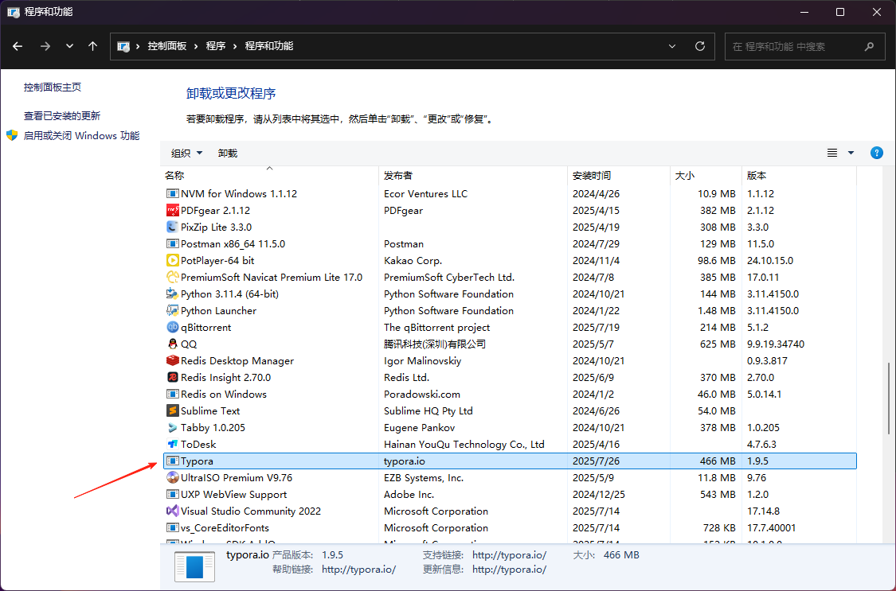

# typora卸载安装教程

## 1.卸载

### 1.控制面板卸载程序

### 2.删除用户目录下的typora文件夹

### 3.删除注册表信息

- win + R 输入`regedit`

- 找到对应的文件夹

## 2.安装

### 1.双击 `typora-setup-x64-1.9.5.exe`

~~~shell
# 注意 安装到最后一步的时候 不要勾选 ,勾选之后会运行typora,不要运行typora
# typora版本最高就到1.9.5 再高版本会激活失败
~~~

### 2.拷贝脚本到typora安装的文件夹下面

### 3.运行脚本1 `node_inject.exe`

需要以管理员身份运行

### 4.运行脚本2 `license-gen.exe`

执行结束之后会有一个激活码 复制一下 然后打开安装好的typora激活即可